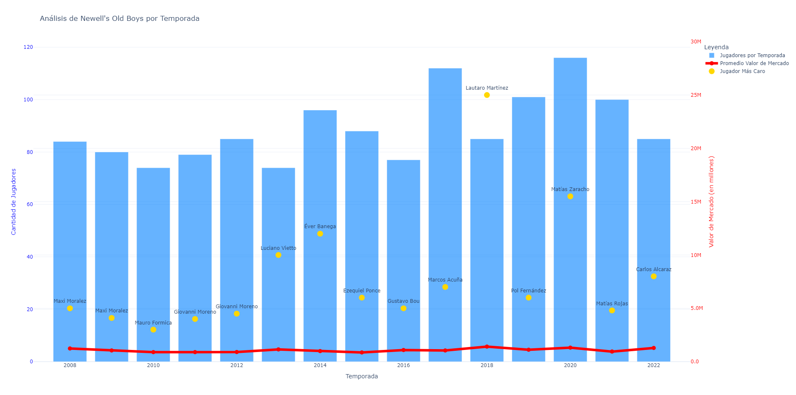
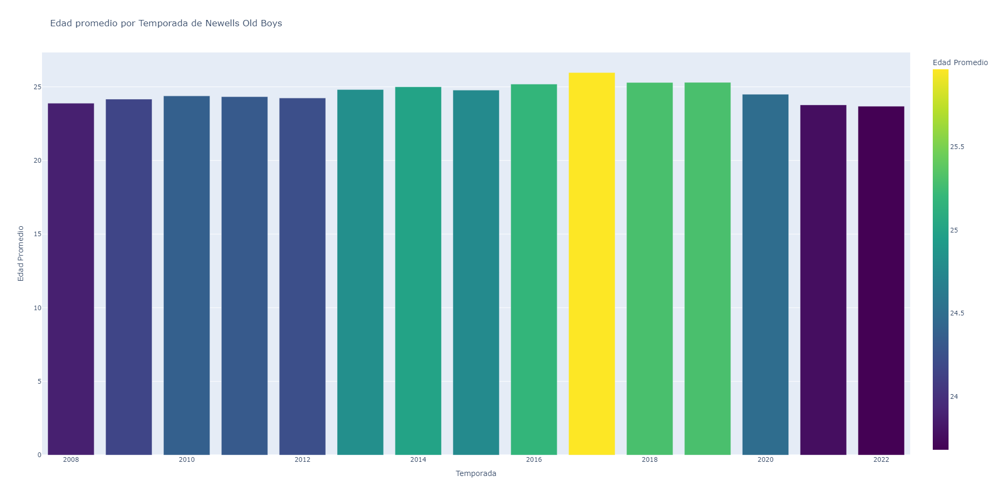

# Análisis de Newell's Old Boys

Este proyecto consiste en un análisis de datos de los jugadores de Newell's Old Boys utilizando información de su valor de mercado y estadísticas relacionadas. Los datos provienen de un archivo de fútbol argentino y se procesaron utilizando **Python** con las librerías **pandas** y **plotly**.

## Nota sobre la base de datos

Es importante mencionar que la base de datos utilizada contiene información incorrecta en algunos casos como nombres de jugadores. Sin embargo, he decidido avanzar en el análisis de todos modos, ya que el propósito principal de este proyecto es practicar y mejorar mis habilidades de análisis de datos. A pesar de las inconsistencias, el análisis realizado puede ser útil para ilustrar algunos aspectos interesantes relacionados con el club.

## Descripción del Análisis

Se realizaron los siguientes análisis:

1. **Jugadores por temporada:** Contabilización de los jugadores presentes en el equipo por temporada.
2. **Valor de mercado:** Análisis del valor máximo de mercado por temporada y cálculo del valor promedio de los jugadores.
3. **Edad promedio:** Cálculo de la edad promedio de los jugadores por temporada.
4. **Jugador más caro:** Identificación del jugador más caro por temporada.

## Gráficos Generados

### 1. Gráfico de Jugadores por Temporada vs. Valor de Mercado

Este gráfico muestra:

- **Barras azules** para la cantidad de jugadores por temporada.
- **Línea roja** para el valor promedio de mercado.
- **Marcadores dorados** para el jugador más caro en cada temporada.

#### Imagen:

### 2. Gráfico de Edad Promedio por Temporada

Este gráfico muestra la **edad promedio** de los jugadores por temporada.

#### Imagen:

## Resultados

- Los jugadores con mayor valor de mercado se encuentran principalmente en las primeras temporadas.
- La edad promedio de los jugadores ha fluctuado en las últimas temporadas, con un ligero aumento en la última.
